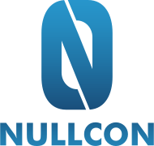

# nullCon CTF 2023

    

### Rules

1. Nullcon HackIM 2023 is a web-based Jeopardy CTF. You do not need a dedicated server or a VPN environment in order to participate.
2. The CTF starts at 06:00 UTC on August 19th and ends at 06:00 UTC on August 20th 2023.
3. Feel free to join our Discord community to chat and ask any questions. We will use Discord as our primary communication channel.
4. Do not attack the CTF infrastructure! All challenges will be very clear on what their endpoint is. No high-traffic / resource-intensive techniques are required if not explicitly stated otherwise.
5. The flag format is ENO{...}, e.g., ENO{th1s_is_4n_eXample}.
6. Sharing flags with other teams is strictly prohibited. Doing so will result in a ban.
7. If you think you have a valid flag that the system rejects or find a bug in the contest infrastructure, please contact us.
8. We use dynamic scoring. Challenges are worth 500 points in the beginning and will decrease in value with the number of solutions. Changes in points are applied retroactively, i.e., solving a challenge early will not give you a major advantage (but will be used as a tiebreaker).
9. Provide a valid email address to be eligible for prizes.
10. Violation of rules will result in a ban. Banned teams or individuals are not eligible for prizes.
11. If you are not sure if something is a violation of the rules, please ask :)

Find this event on CTFtime: https://ctftime.org/ctf/27.
This CTF is brought to you by ENOFLAG.

GL HF!
